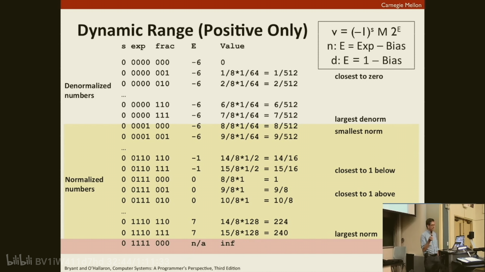
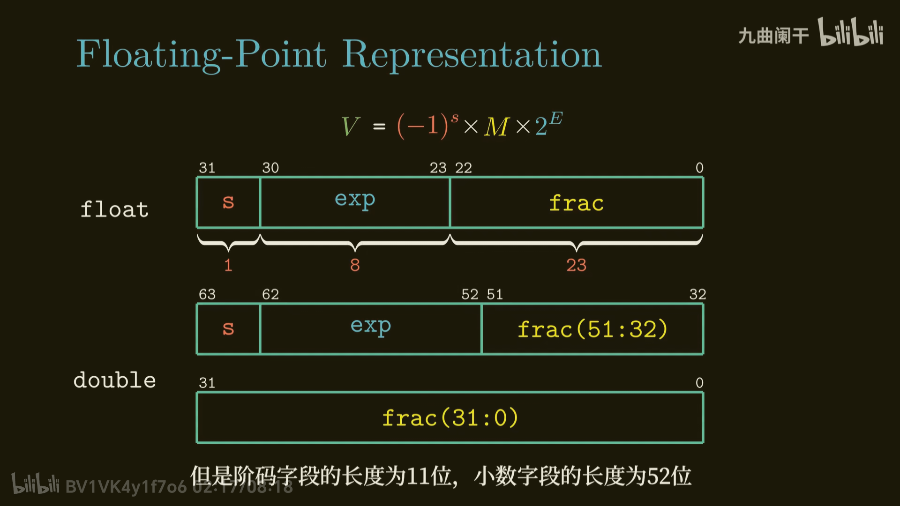
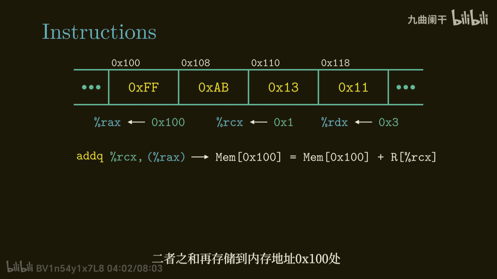
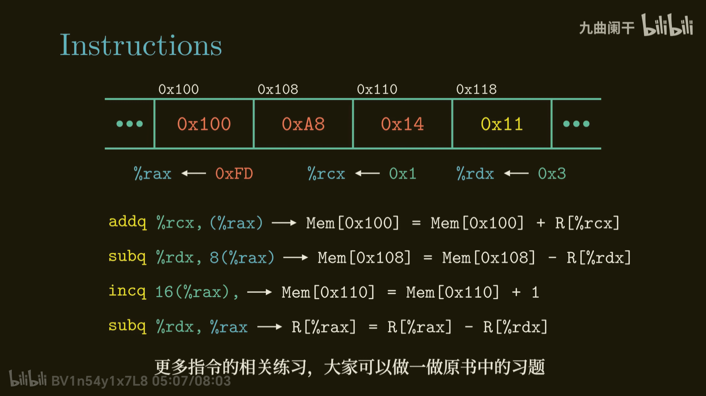

## 1-1

从最简单的的hello.c开始，我们可以使用gcc -o hello hello.c,分为四个阶段，预处理，编译，汇编，链接

1. 预处理(pre-processor)
预处理命令就是'#'包含的,包括有宏等,经过预处理,hello.c就变为了hello.i文件。\
移除注释。\
处理宏定义。\
处理条件编译指令（例如 #ifdef、#ifndef）。\
展开头文件（#include）
2. 编译(compiler)
hello.i文件经过编译之后会生成hello.s(汇编文件).

3. 汇编(assemble)
将上一步的hello.s编译为hello.o文件,这是一个可重定向的文件

4. 链接(link)
将我们hello.c文件中的printf.o文件与hello.o文件合并,最终生成我们想要的结果\

牢记这四步的发生!

## 1-2

顺便回顾一下gcc命令选项,默认什么都不加的话是生成a.out

```shell
# 这个意思是我不想要叫做a.out名字的程序,我把这个起了个我想要的名字 myFile
gcc -o myFile hello.c

#只编译源文件而不进行链接,有些东西在编译的时候是没问题的,链接就会有问题,这个会生成.o文件
gcc -c hello.c

#编译时可生成调试信息
gcc -g hello.c

#还有就是编译标准,就是使用c11标准来编译源文件

gcc -std=c11 hello.c
```

个人认为这就是比较有用的命令.

## 1-3

程序计数器(pc),program counter。实际上就是一个rs,里面存储着下一条命令的地址，当结束当前命令的时候，计数器会跳到下一条要执行的命令地方，进而使程序执行下去。
内存四区中不太熟悉的两个区

1. 代码区
    
在代码区中，顾名思义，存放的是编译后的机器代码，这些代码通常只是可读的，不支持修改。

2. 数据区

也叫做全局区，存放的是全局变量和静态变量，包括已经初始化的全局变量和未经初始化的全局变量，特点是在程序开始时就分配好内存，一直存在，直到程序截至,其中,未经初始化的全局变量在初始时一般会被赋值为0

## 1-4

1. 抽象的概念
2. 加速比
阿姆达尔定律,指的是加速效率,比如,我们想要把某个程序在不改变原来算法的情况下把源程序的速度提高5倍,这时,我们就可以通过这个公式来考虑\
假设原来的运行时间为 $T_{old}$,这里还有一个概念是加速因子 $a$,这个的意思是说,可加速部分的时间是$aT_{old}$,所以不可加速的部分是$T_{old}-aT_{old}$,假设经过加速的加速因子速度为 $K$,可加速部分就是$\frac{a}{K}T_{old}$,不可加速部分时间就是$(1-a)T_{old}$,所以加速后总程序时间就是这两部分和 $\frac{a}{K}T_{old}+(1-a)T_{old}$
所以前后的时间之比为
$$\frac{T_{old}}{\frac{a}{K}T_{old}+(1-a)T_{old}}$$
进行约分,发现结果为
$$\frac{1}{\frac{a}{K}+(1-a)}$$
假设$a=0.6,K=3$,计算得加速比是$1.67$,考虑一种极限情况,当加速因子趋于无穷大时,也就是我们把这$0.6$,也就是把这百分之60加速到几乎不花时间,我们发现程序最多也能到 $\frac{1}{1-a}$ 我们发现加速时间比取决于可加速的部分$a$,当$a$可加速部分越多,时间也就快

## 2-1

1. 信息的存储
   字节存储
   一个字节是8位(bits),然后就是字节序的概念,这里分为大端存储和小段存储\
   大端存储:高位在内存的低地址处,低位在内存的高地址处\
   小段存储:低位在内存低地址处,高位在内存高地址处.
   考虑一个数0x87654321,一个很自然的想法,和在十进制里面一样,从右向左是低位数字到高位数字,那么考虑地址,我们假设有一块地址是0x01,0x02,0x03,0x04,正好够储存一个32位的数字,根据小端序,这段数字在内存里面的存储方式就是:|21|43|65|87|,正好是反着读的,而在大端序里面就是
   |87|65|43|21|
   ps:现在绝大多数机器都是小端序存储.

2. 字符串存储
   c语言的字符串是以'\0'结尾
   位运算与16进制表示方法
   突然想起来RISC-V里面的的一个小练习:有一个数0x87654321,我先要得到高四位数字即,0x8765,和低四位0x4321,这里就用到了一个位运算 $&$操作,可以让0x87654321与上0xffff0000,然后再进行右移操作,同理得到低四位可以让0x87654321与上0x0000ffff,那么就可以得到低四位.
   然后就是逻辑右移和算数右移,左移都是一样的,在后面补0就可以了,右移的话,如果是算数右移,那么有符号数就要考虑符号位的情况了,如果符号位是1,那么算数右移后前面也应该补上1,对于无符号数来说补0就可以.

## 2-2

1. 有符号数和无符号数\
比较有趣的是$0xff$这个数其实在表示的时候是个-1,这是对于有符号数,对于无符号数来说,这个就是无符号数的最大值,其次,我们还可以根据下面(2)中的补码视角来看这个数,对于这个数来说,最高位就是$-2^8=-256$,后面那七位都是正的,和就是


2. 补码新的计算方式，实际上计算负数的补码时，不仅可以通过源码按位取反，反码加1来的到补码，反而还可以使用二进制的直接概念，把符号位的那个1来当做负数来参加运算，比如，-10的原码是$11010$,那么他的反码就是$10101$(注意,按位取反的时候符号位不用取反),那么他的补码就是$10110$
我们可以来看一眼这个数代表多少,按照以往的方法,那么还得先减1然后再取反的到原码,然后根据原码来确定这个数是多少,现在,我们可以直接使用一个小技巧,把第一位那个1当作负数去参加运算,就是$-2^4+2^2+2^1=-16+4=2=-10$,直接就可以看出来是-10

3. 位运算小技巧
   如何得到一个数的负数
    1. 按位取反再加1,对于一个x, $-x=~x+1$
    2. lowbit,得到一个数的二进制的最右边那个1,比如1个数$0101 0110$,最右边那个1就是$0000 0010$,可以用$x&-x$,也是$x&(~x+1)$
4. 课堂测验

对于一个有符号数$x,y$,下面结论是否正确

$x<0\Rightarrow x*2<0$\
$ux>=0$\
$(x与7)==7\Rightarrow((x<<30)<0)$\
$ux>-1$\
$x>y \Rightarrow -x<-y$\
$x*x>=0$\
$x>0 and y>0\Rightarrow x+y>0$\
$x>=0\Rightarrow -x<=0$\
$x<=0\Rightarrow -x>=0$\
$(x|-x)>>31 \Rightarrow 结果为-1$

第一个不对,可能会溢出为正数,第二个是无符号数,第三个正确,第四个不对,-1是最大的无符号数,第五个也不对,假设y是最小的有符号数,即$10000 0000$,按照之前的取相反数的技巧,按位取反+1,按位取反是$01111 1111$,加上1后还是$10000 0000$,所以这个是不对的,六七都是有可能溢出,第八个$x>=0\Rightarrow -x<=0$这个是正确的,因为按照之前的数最大的数就是$01111 1111$按照之前的技巧就是$10000 0000+1$我们发现这个不会溢出,所以这个是正确的,第九个同理,最后一个,我们发现根据补码规则x|-x的第一位,如果x不是0的话,那么最高位为1,那么右移是算数右移,最高位是1,右移31位后那么就是$1111 1111$就是-1,但是对0来说不成立

## 2-3

1. 浮点数的存储方式

在C语言中,浮点数分为双精度(double)和单精度(float)两种类型.\
单精度浮点数:
   占4个字节,总共32位,最高位是符号位,有8位表示指数部分(阶码),剩下23位表示尾数部分

双精度浮点数:
   占8个字节,总共64位,与单精度浮点数相同,最高位是符号位,有11位是指数部分(阶码),剩下52位是尾数部分

对于这两个浮点数都可以分成3部分,第一部分是符号位,0表示正数,1表示负数;第二部分是阶码值;第三部分是尾数部分.

2. 浮点数的格式化
   
   关于中间阶码的值,可以把浮点数划分为3类,第一种是阶码字段不全为0并且不全为1,表示规格化(Normalized)
   中间的值全为0时,表示的是非规格化的值
   中间的值全部为1时,表示的是特殊值,比如无穷大,无穷小,不是一个数.

3. 关于浮点数的表示
   
   我们在这里考虑一个三位二进制浮点数，就是一共有八位，第一位是符号位，第二位到第五位是指数值E，第六位到第八位是三位数，是小数部分
   可以表示为$(-1)^sM2^E$,其中s是符号位的值，是正数的话就是0，不是正数的话就是1，其次就是关于中间的四位值，这四位的值表示exp部分，即$E=exp-bias$,通过这个方法，我们就可以求得$E$的值,这个exp就是根据这四位的数来得到的,然后就是bias这个值,其中,bias又因为规格化和非规格化的值而不同,在上文中,我们知道exp部分如果不全为0或者不全为1,那么这个数就是规格化的,对于一个规格化的数来说,$E=exp-bias$,对于非规格化的数,$E=1-bias$,李儒对于1个数$0 0000 001$,这是1个denormalized number,因为指数部分全部都是0,那么他的$E=1-bias$,而bias又与指数的位数有关,对于常见的float类型的浮点数,有八位是用来表示指数的,那么bias就是$2^{(8-1)}-1$,也就是127,对于双精度浮点数来说,有11位是用来表示指数部分,所以bias就是$2^{(11-1)}-1$,也就是1023,所以,我们现在可以表示一个数,然后来看一看这个数代表这多少.

4.examples
  这里可以举例两个数,一个是规格化的数,另一个是非规格化的数\
      1. 非规格化的数
         $0 0000 110$,这个总共是8位数,那么可以根据我们的公式来做题,$E=1-bias=1-7=-6$,$M=\frac1 2+\frac{1}{4}=\frac{6}{8}$,所以这个小数实际上表示的是$\frac{6}{8}*2^{(-6)}=\frac{6}{512}$
      2. 规格化的数
         例如$0 0110 110$,bias就是7,而中间四位表示的是6,那么指数$E=6-7=-1$,尾数是$1+\frac1 2+\frac 1 4=\frac{14}{8}$,因为任何规格化的小数都可以化为1+尾数乘以$2^{n}幂的形式,所以,第一位其实永远都是1,那么我们就没有必要去存储这个1,在做运算的时候加上这个1即可
      3. 附送例子图片
         
         
         

   5. 注意
      浮点数加法并不满足结合律,例如$3.14+1E20-1E20=0$,而$3.14+(1E20-1E20)=3.14$,在人类看来,这是一样的,在计算机看来,因为$3.14+1E20$是一个浮点数,那么这个数太大就无法保存得下所有的位数,那么就会把3.14舍弃,所有结果就是0,而后者却不是,同时,也不满足乘法交换律。
   6. 计算方法
      给定一个数，我们怎么把它转换为二进制数
      例如14.0/16,需要注意的是，如果不加小数点后面的0的话，其实是整数数除法，会发生截断，这个数也就是0.111(0.5+0.2+0.125=0.875)
      也就是$1.11*2^{-1},根据分析,这是一个规格化的数,也就是在32位浮点数中,bias就是127,$E=exp-bias=-1$,所有就exp(阶码)就是$E+bias=-1+127=126$,也就是$0111 1110$,所以,我们就可以直接写出这个浮点数的二进制形式就是$0(sign) 0111 1110(exp) 110 0000 0000 0000 0000 0000(frac,尾数)$,所有直接合并一下就是
      $0011 1111 0110 0000 0000 0000 0000 0000$,也就是 $0x3f600000$

## 3-1
1. 程序的机器级表示
   ```shell
   gcc -Og -o prog main.c mstore.c
   ```
   在这个程序中,-Og是编译器优化选项 -o是前面提到过的改名方式
   在这之后,会生成一个prog的.o文件,其实是一个二进制文件,通过编译生成的二进制文件可以通过反汇编器来看里面的汇编代码

2. 寄存器
   在反汇编时,我们可以查看到代码中的操作数,就是带%的那些数字,这些数叫做Operands(操作数),下面自己敲了一个test.c看一看
   ```c
   #include<stdio.h>
   int main(){
      int a=0;
      int b=0;
      int c=0;
      a=a+1;
      b=b+1;
      c=c+2;
   }

   ```

   下面是生成的汇编代码

   ```assembly

   test.o:     file format elf64-x86-64
   Disassembly of section .text:

   0000000000000000 <main>:
      0:	f3 0f 1e fa          	endbr64 
      4:	55                   	push   %rbp
      5:	48 89 e5             	mov    %rsp,%rbp
      8:	c7 45 f4 00 00 00 00 	movl   $0x0,-0xc(%rbp)
      f:	c7 45 f8 00 00 00 00 	movl   $0x0,-0x8(%rbp)
   16:	c7 45 fc 00 00 00 00 	movl   $0x0,-0x4(%rbp)
   1d:	83 45 f4 01          	addl   $0x1,-0xc(%rbp)
   21:	83 6d f8 01          	subl   $0x1,-0x8(%rbp)
   25:	83 45 fc 02          	addl   $0x2,-0x4(%rbp)
   29:	b8 00 00 00 00       	mov    $0x0,%eax
   2e:	5d                   	pop    %rbp
   2f:	c3                   	ret    
   ```
   在这个汇编的指令中,早期的8086是16位的,所以把16位的数叫做一个字
   movb - Move Byte:
   movb 用于移动一个字节（8位）的数据。
   示例：movb source, destination
   movw - Move Word:
   movw 用于移动一个字（16位）的数据。
   示例：movw source, destination
   movl - Move Long:
   movl 用于移动一个双字（32位）的数据。
   示例：movl source, destination
   movq - Move Quadword:
   movq 用于移动一个四字（64位）的数据。
示例：movq source, destination
   在操作数中,包括立即数,寄存器,内存引用
   在上面那个汇编代码中,带%的都是寄存器调用,带$的都是一个立即数,带()的是内存引用,下面来重点看一下内存引用的情况
3. 内存引用
   在讨论内存的时候,可以把内存抽象成一个数组,一个最常用的内存引用就是$Imm(r_b,r_i,s)=Imm(立即数)+R[r_b]+R[r_i]·s$
   这个$r_b$表示基址寄存器,$r_i$叫做变址寄存器,$s$叫做比例因子,而且这个比例因子通常是1,2,4,8其中的一个,主要是内存对齐吧,加速访问速度

## 3-3
   1. 算数和运算指令
   
   这个addq命令是相加指令,格式是 addq 源地址 目的地 ,像这个命令,括号是内存引用的意思,也就是引用rcx这个寄存器里面的值,然后加到目的地里

   
   其实仔细想一想就可以理解了

## 3-5
1. 条件码
   常用的条件码有CF(Carry Flag,进位标值):
     这个标志为可以用来检查无符号数的溢出,如果产生溢出,那么进位标志就会置为1.
   还要ZF,零标志,如果结果是0,那么这一位就会是1
   SF标志,sign Flag,符号标志,最近的操作小于0,那么就会被置为1
   OF,溢出标志,发生负溢出或者正溢出的时候,这一位就会成为1


2. 示例
   ```cpp
   int comp(long a,int b){
      return a==b;
   }
   ```

3. switch的小知识
   switch其实是过度了的goto语句,switch比if-else语句要快,这是因为switch的底层是维护了一个jump table(跳转表),就是一个数组,所以访问时间是o(1)的,同时也做了一些优化,比如当case的情况是 case -1时,往往会加上一个偏移量,从而避免了出现负索引的情况,还有就是,比如这里只有两种可能的情况,比如 case 1和case 50000这两个case 情况,那么并不会创建一个超级大的数组去存入这两个值,而是会根据实际情况去用 if else 去替代这种情况
   在写作业的时候发现,其实如果在case 语句当中不加上花括号的时候去声明变量其实是不会被允许的,因为这只是

   **C语言中的switch语句有一个特殊的执行机制，即“贯穿”（fall-through）现象。在没有break语句的情况下，switch语句会一直执行下去，直到遇到break或者switch块结束。这导致了一个问题：如果在case块内部定义了局部变量并初始化，当控制流穿越到另一个case时，由于变量仍然在作用域内，可能导致重定义的问题.**
   也就是说,在一个switch花括号里面其实是同一个作用域,在case 1里面定义过的变量有可能会被重复在case 2里面定义,所以不允许这样做.
   


